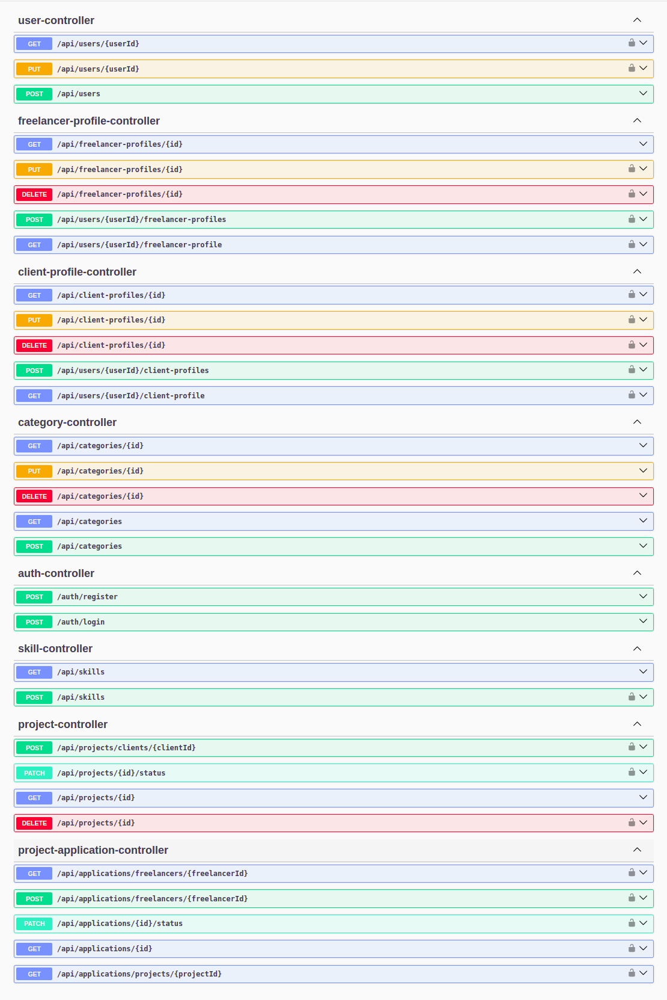

# SooqTalent - Freelancing Platform 

SooqTalent is a RESTful API for a freelancing platform that connects clients with freelancers. The platform allows clients to post projects, freelancers to create profiles and bid on projects, and facilitates the entire freelancing workflow.

### 🚀 Features

- **User Authentication**: Secure JWT-based authentication with role-based access control (CLIENT, FREELANCER, ADMIN)
- **Freelancer Profiles**: Freelancers can create and manage their professional profiles
- **Project Management**: Clients can post, update, and manage their projects
- **Bidding System**: Freelancers can bid on available projects
- **Category Management**: Projects organized by categories
- **Skill Tracking**: Freelancers can showcase their skills
- **RESTful API**: Well-designed API endpoints for seamless integration with frontend applications

### 🛠️ Tech Stack

- **Java 17**: Modern Java features for robust backend development
- **Spring Boot 3.x**: Framework for creating stand-alone, production-grade Spring applications
- **Spring Security**: Authentication and authorization with JWT
- **Spring Data JPA**: Simplified data access layer
- **MySQL**: Relational database for data persistence
- **Docker**: Containerization for easy deployment
- **Maven**: Dependency management and build tool
- **Lombok**: Reduces boilerplate code
- **SpringDoc OpenAPI**: API documentation with Swagger UI

### 📋 Prerequisites

- JDK 17 or higher
- Maven 3.6+
- Docker and Docker Compose (for running with containers)
- MySQL (if running without Docker)

### Setup and Installation

#### Using Docker (Recommended)

1. Clone the repository:
   ```bash
   git clone https://github.com/AbderrahimeEl/sooqtalent-rest.git
   cd sooqtalent-rest
   ```

2. Start the application with Docker Compose:
   ```bash
   docker-compose up -d
   ```

3. The API will be available at `http://localhost:8080`

#### Manual Setup

1. Clone the repository:
   ```bash
   git clone https://github.com/AbderrahimeEl/sooqtalent-rest.git
   cd sooqtalent-rest
   ```

2. Configure MySQL:
   - Create a MySQL database named `sooqtalent`
   - Update `src/main/resources/application.properties` with your database credentials if needed

3. Build and run the application:
   ```bash
   mvn clean install
   mvn spring-boot:run
   ```

4. The API will be available at `http://localhost:8080`

### 📚 API Documentation

Once the application is running, you can access the API documentation at:
- Swagger UI: `http://localhost:8080/swagger-ui/index.html`

### 🌐 API Endpoints

The API provides the following main endpoints:

